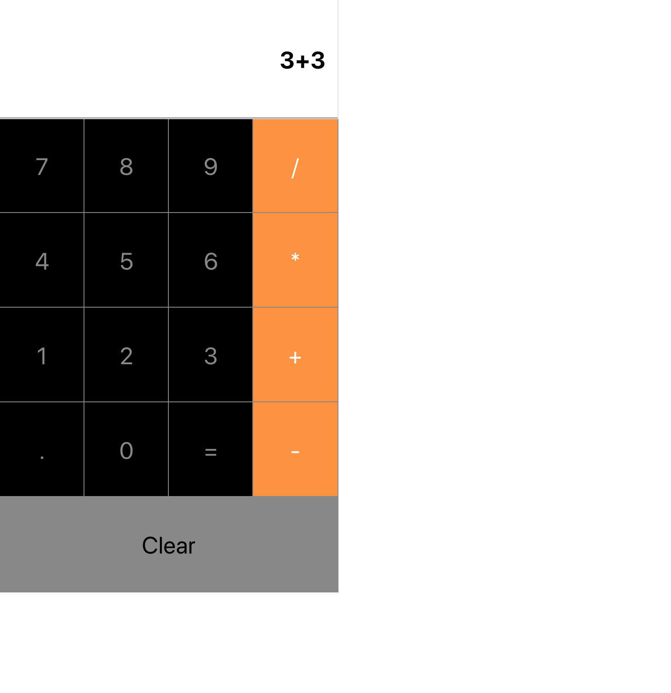

##CALCULATOR REACT APP 

This app was built using create-react-app, flexbox, and mathjs 

Frameworks used: 

`create-react-app`

`flexbox`

`npm`

`node`

`mathjs`

`express`

`path`

`body-parser`

`heroku`

<h3>Scripts</h3>
`npm start` - starts node server
`npm run-script dev` - react-scripts start (dev mode)
`npm run-script build` - builds project
`npm run-script test`- test

<h3>Screenshot</h3>

